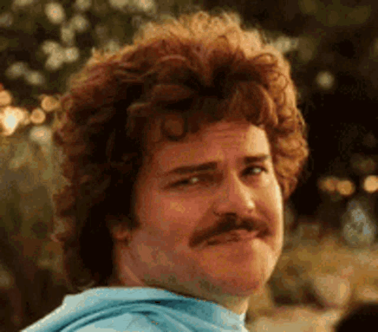
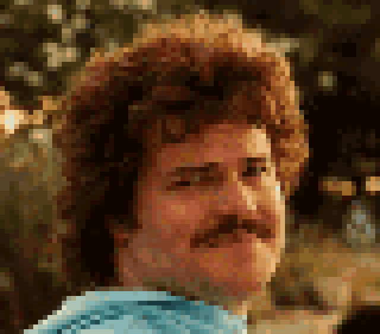

# pixelate-gif

A pure-Python script to pixelate GIFs and images. It down-samples to lose detail, then upscales with nearest-neighbor interpolation for a blocky, retro look.

## Features
- Works on GIFs (animated or static) and regular images
- Adjustable pixelation factor
- Preserves animation timing and loop count
- No external dependencies beyond Pillow and imageio

## Installation

```bash
pip install pillow imageio
```

## Usage

### GIF input

```bash
python pixelate_gif.py input.gif pixelated.gif --factor 10
```

- `input.gif`: Path to your source GIF
- `pixelated.gif`: Output path
- `--factor`: (Optional) Pixelation factor (default: 8)

### Image input

```bash
python pixelate_gif.py input.png pixelated.png --factor 10 --input-type image
```

- `--input-type`: `auto`, `gif`, or `image` (default: `auto`)
- In `auto` mode, `.gif` uses GIF processing and every other extension uses image processing.

## How it works
1. Detects GIF or image input type (`auto`, or forced via `--input-type`)
2. Downscales and upscales with nearest-neighbor
3. Re-encodes GIF frames with timing/loop metadata or writes a single image output

## Tweaks
- Change `factor` for chunkier or finer pixelation
- Use `Image.BILINEAR` for a softer look
- Crop and pixelate only a region for selective effects

## Example

Original GIF | Pixelated GIF
:---:|:---:
 | 

This shows how the script pixelates every frame while preserving animation and looping.